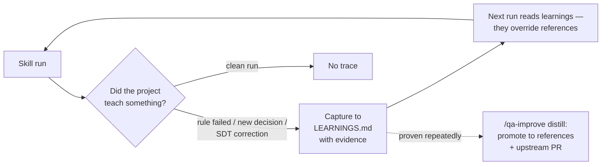

<div align="center">

# QABuddy

**A QA foundation that learns your project**

[한국어](README.md) · [English](README-en.md)

[](LICENSE)
[](#skills)
[](#how-it-works)
[](#locales)
[](#how-it-works)

An AI partner for Software Developers in Test (SDTs) working in Scrum teams.<br>
Covers the full workflow — from epic test planning through sprint execution to release verification.<br>
Every team's QA needs are different — so QABuddy ships as a foundation that **self-improves**:<br>
every skill run captures project-specific learnings and applies them on the next run.<br>
Officially supports **Claude Code**. No Jira required.<br>
(Unverified installers for Cursor/Copilot are still built — see below.)

Built on the native **skills system** of your AI coding assistant.<br>
QABuddy is a collection of `SKILL.md` files that your AI discovers and invokes automatically —<br>
no separate app, no daemon, no dependencies beyond Node.js.

[Quick Start](#quick-start) · [Skills](#skills) · [Guided Workflow](#the-guided-workflow) · [Contributing](CONTRIBUTING-en.md)

</div>

---

## Why QABuddy?

| Without QABuddy | With QABuddy |
|---|---|
| Manually write test plans from scratch | `/qa-start` generates test plans from epic context |
| Review tickets by memory during grooming | `/qa-review-ticket` audits ACs with structured checklists |
| Track test coverage in spreadsheets | Knowledge base tracks coverage with traceability mappings |
| File bugs via copy-paste into Jira | `/qa-qa` files bugs automatically with repro steps + screenshots |
| Fix a skill issue? Rewrite from scratch | `/qa-improve` analyzes the failure, fixes it, runs regression tests |
| Same static tool forever, on every team | Every run captures your project's quirks into a learnings layer — QABuddy evolves to fit your team |

---

## Quick Start

```bash
git clone https://github.com/TimothyHan/QABuddy.git && cd QABuddy
node build.js all              # Build for all platforms
dist/claude/setup              # Install
```

Then:
```
/qa-setup                      # Configure your project (first time only)
/qa-start EPIC-123             # Begin the guided workflow
```

<details>
<summary><strong>Windows (PowerShell)</strong></summary>

```powershell
git clone https://github.com/TimothyHan/QABuddy.git
cd QABuddy
node build.js all
.\dist\claude\setup.ps1
```

> Symlinks require Developer Mode enabled or running as Administrator.
> Falls back to directory junctions automatically if symlinks fail.

</details>

---

## Skills

### Guided Workflow

| Skill | Command | What it does |
|-------|---------|-------------|
| **Setup** | `/qa-setup` | First-run wizard: context source, team mode, project preferences |
| **Start** | `/qa-start` | Guided end-to-end workflow: setup → test plan → reviews → test cases |

### QA Skills

| Skill | Command | Sprint Phase | What it does |
|-------|---------|-------------|-------------|
| **Test Plan** | `/qa-test-plan` | Epic created | Test strategy, automation gaps, success criteria, risks |
| **Review Ticket** | `/qa-review-ticket` | Grooming | Audit ACs, testability, missing edge cases, blockers |
| **Test Cases** | `/qa-test-cases` | Sprint execution | Playwright e2e + unit test checklist from ACs |
| **QA** | `/qa-qa` | Feature ready | Execute test cases, verify ACs, file bugs |
| **Verify Fix** | `/qa-verify-fix` | Bug fixed | Re-test fix, check regressions, update bug status |
| **Exploratory** | `/qa-exploratory` | Feature ready | Charter-driven exploratory testing session |
| **E2E Setup** | `/qa-e2e-setup` | Automation start | Probe the app, scaffold Playwright, record decisions in AUTOMATION.md |
| **E2E POM** | `/qa-e2e-pom` | Automation | Build/heal page objects by live discovery — every locator proven, never guessed |
| **E2E Write** | `/qa-e2e-write` | Automation | Test suites from test cases: API preconditions, intent-only specs, four quality gates |

### Meta Skills

| Skill | Command | What it does |
|-------|---------|-------------|
| **Improve** | `/qa-improve` | Fix skill failures; distill the learnings layer (dedupe, retire, promote to canon) |
| **Eval** | `/qa-eval` | Run eval fixtures against a skill to verify correctness |


> Commands use the default `qa-` prefix. Install with `--no-prefix` to use bare names.

---

## The Guided Workflow

Instead of invoking skills individually, `/qa-start` walks you through the full QA planning workflow:

```
/qa-start EPIC-123

  Phase 1: Setup ─────── reads config, loads context
       ↓ pause
  Phase 2: Test Plan ─── drafts strategy, initializes KB
       ↓ pause
  Phase 3: Reviews ───── audits each story (Jira mode)
       ↓ pause
  Phase 4: Test Cases ── generates tests + traceability
       ↓ pause
  Phase 5: Summary ───── "Planning complete. Ready for QA."
```

At every pause, you choose:

| Option | What happens |
|--------|-------------|
| **(A) Approve** | Continue to next phase |
| **(B) Content feedback** | Iterate on the output |
| **(C) Tool feedback** | Dispatches to `/qa-improve`: root cause, approved fix, rebuild, eval — then resumes |

---

## Configuration

Run `/qa-setup` to configure. Settings saved to `.qabuddy.json`:

| Setting | Options | What it controls |
|---------|---------|-----------------|
| **Context source** | Jira, spec docs, chat, custom | Where skills pull feature context |
| **Team mode** | Solo, team | Solo = local. Team = PRs via `gh` CLI |
| **Upstream contributions** | Yes, no | Auto-PR improvements to QABuddy repo |

> **No Jira? No problem.** Set context source to "spec" or "chat". Bugs are written
> to `features-kb/` as markdown. Works with any project management tool.

<details>
<summary><strong>Team Practices (optional)</strong></summary>

During setup, QABuddy asks if your team has documented processes for:

| Practice | Saved to |
|----------|----------|
| Bug triage / intake | `features-kb/team-practices/bug-triage.md` |
| Hotfix testing | `features-kb/team-practices/hotfix-testing.md` |
| Test data management | `features-kb/team-practices/test-data.md` |
| Release workflow | `features-kb/team-practices/release-workflow.md` |
| Accessibility requirements | `features-kb/team-practices/accessibility.md` |
| CI/CD pipeline | `features-kb/team-practices/ci-cd-pipeline.md` |

If defined, skills follow them automatically. If not, skills ask case-by-case.

</details>

---

## Prerequisites

- **Node.js** — for the build script (zero npm dependencies)
- **Atlassian MCP** — optional, only for Jira mode
- **Playwright MCP** — fallback for browser testing (Chrome extension recommended on Claude Code)

<details>
<summary><strong>MCP Configuration</strong></summary>

**Atlassian:**
```json
{
  "mcpServers": {
    "atlassian": {
      "command": "npx",
      "args": ["-y", "@anthropic/mcp-atlassian"],
      "env": {
        "JIRA_URL": "https://your-domain.atlassian.net",
        "JIRA_EMAIL": "your-email@company.com",
        "JIRA_API_TOKEN": "your-api-token"
      }
    }
  }
}
```

**Playwright:**
```json
{
  "mcpServers": {
    "playwright": { "command": "npx", "args": ["@playwright/mcp@latest"] }
  }
}
```

Add to: `~/.claude/settings.json` (Claude) · `.cursor/mcp.json` (Cursor) · `.vscode/mcp.json` (Copilot)

</details>

---

## Feature Knowledge Base

Skills produce and consume test artifacts from `features-kb/` — this is how they stay connected:

```
features-kb/
├── index.json                        # Feature index + workflow state
├── team-practices/                   # Team-specific processes
└── features/{EPIC-KEY}/
    ├── feature.md                    # Epic summary, capabilities, ACs
    ├── test-plan.md                  # Test strategy
    ├── test-cases/{TICKET}.md        # Test cases + traceability mappings
    ├── reviews/{TICKET}-review.md    # Ticket reviews
    ├── qa-reports/{TICKET}-{DATE}.md # QA results
    └── bugs/BUG-{NNN}.md            # Bugs (when no Jira)
```

| Context source | Naming convention | Example |
|---|---|---|
| Jira | Jira keys | `features/PROJ-123/test-cases/PROJ-456.md` |
| GitHub Issues | `GH-42` or slug | `features/GH-42/test-cases/GH-55.md` |
| Spec / Chat | Descriptive slugs | `features/auth-system/test-cases/login-page.md` |

---

## Self-Improvement

QABuddy is a foundation, not a finished tool. Every SDT's needs differ per project and per team — so instead of shipping one static behavior, QABuddy **evolves**: install the same foundation everywhere, and six months later yours is different from every other team's, because it has absorbed your app's quirks, your team's conventions, and your accumulated failures.



**The learnings layer (automatic, every skill run).** Every run reads `features-kb/LEARNINGS.md` at start — active entries are project-specific rules that *override* the shipped references — and checks three capture triggers at the end: a documented rule failed against reality, an undocumented decision was made, or the SDT corrected the output. Entries require evidence; clean runs write nothing. Every run starts by **compiling** the reference sections and learnings scoped to it into one `slice.md` with a manifest (`.qa-reports/runs/<run>/`), then appends what it *applied*, *contradicted*, *captured*, and how it *ended* to `features-kb/learnings-log.jsonl` (append-only, written by the shipped `qab.js` helper — never by hand), and names recurring failure classes in `features-kb/fingerprints.jsonl` so a learning that claimed to prevent one is falsified automatically — distill decides from counts, not prose. Both files live in your repo, so learnings travel to your whole team via git and survive QABuddy upgrades. Protocol: [`core/references/self-improve.md`](core/references/self-improve.md); design: [RFC 0001](docs/rfc/0001-context-compiler.md).

**Skill fixes.** One flow, one owner: `/qa-improve`. Choose **(C) Tool feedback** at any pause point (it dispatches to `/qa-improve` and resumes your workflow), run it directly, or accept the end-of-run suggestion when a captured learning points at a skill defect — structured proposal, targeted fix, eval regression run, PR.

**Distillation & promotion.** `/qa-improve` distill mode sweeps the learnings layer with the log's numbers (`applied ≥ 3` across `≥ 3` runs and never contradicted → promotion candidate; `contradicted ≥ 2` with no application since → falsified): merges duplicates, retires falsified entries, and promotes proven rules into the canonical references — and, with `contributeUpstream` enabled, PRs them to the QABuddy repo so everyone benefits.

**Quality gate.** `/qa-eval` runs fixture suites against any skill — including execute-mode fixtures that grade real `npx playwright test` exit codes against a bundled fixture app.

---

## How It Works

**Claude Code is the officially supported platform** — the only one CI verifies end to end
(build → install → status → uninstall) on Linux and Windows (PowerShell 5.1) on every push.

> **Cursor / Copilot (unverified):** the build still produces all three platform outputs, and
> the installers in `dist/cursor/` and `dist/copilot/` ship as-is. They pass the structural
> test suite (ownership verification, dynamic skill enumeration), but **CI does not execute
> them** — use at your own risk. Issue reports welcome.
>
> **Upgrading from ≤ v0.2.2:** legacy copy installs carry no ownership marker, so a fresh
> install FAILs on them for safety. Instead of manual deletion, run once with `--adopt`
> (bash) / `-Adopt` (PowerShell) — it adopts only evidence-checked legacy QABuddy copies
> (SKILL.md must mention QABuddy) and never touches other tools' directories.

Skills are authored once in `core/skills/`. The build script generates platform-specific output:

| | Claude Code | Cursor | Copilot |
|---|---|---|---|
| **Frontmatter** | `allowed-tools` | `name` + `description` | `name` + `description` |
| **Browser** | Chrome ext > Preview > Playwright | Playwright MCP | Playwright MCP |
| **Project file** | `CLAUDE.md` | `.cursor/rules/qabuddy.mdc` | `.github/copilot-instructions.md` |
| **Install** | Global symlinks | Symlinks or project copy | Repo copy |
| **Hooks** | SessionStart | SessionStart | Preamble reads config |

```bash
node build.js all                  # Build for all platforms
node build.js all --locale ko      # Build Korean version
node test.js                       # Run 1098 structural checks
```

> **Structural checks are not behavioural verification.** `node test.js` inspects
> the *shape* of the build output — frontmatter, locale parity, placeholder
> substitution, dist BOM, and whether the setup scripts contain their ownership
> logic. Whether those scripts actually *behave* correctly is verified by the CI
> execution jobs: the foreign-decoy test, reinstall idempotency, the `--adopt`
> migration smokes, and full PowerShell 5.1/7 cycles.

<details>
<summary><strong>Project Structure</strong></summary>

```
QABuddy/
├── build.js                     # Build script (node, zero deps)
├── test.js                      # Structural check suite (1098 checks)
├── core/                        # Single source of truth — edit here
│   ├── skills/ (14)             # Skill templates with {{placeholders}}
│   ├── references/playbook/     # 10 methodology files
│   ├── preamble-base.md         # Tier 1 preamble (all skills)
│   ├── preamble-full.md         # Tier 2 additions
│   └── project-instructions.md
├── platforms/                   # 3 platform configs + 6 setup scripts
├── locales/ko/                  # Korean translation
└── dist/                        # Generated (gitignored)
```

</details>

---

## Contributing

See [CONTRIBUTING.md](CONTRIBUTING-en.md) for the full guide. Key points:

- **Sonnet is the minimum model** — skills must work on Sonnet, not just Opus
- **300-line budget** per skill, 530-line total context per invocation
- **Constraints at top**, self-evaluation on every skill, completion status block
- **Test with `node test.js`** after every change
- **Korean locale** — new skills need a translation in `locales/ko/`

## License

[Apache 2.0](LICENSE) — free to use, modify, and redistribute with attribution.

## Code of Conduct

[Contributor Covenant 2.1](CODE_OF_CONDUCT-en.md)
