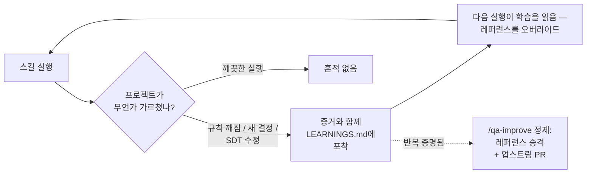

<div align="center">

# QABuddy

**당신의 프로젝트를 학습하는 QA 파운데이션**

[한국어](README.md) · [English](README-en.md)

[](LICENSE)
[](#스킬)
[](#작동-방식)
[](#로케일)
[](#테스트)

스크럼 팀에서 일하는 SDT(Software Developers in Test)를 위한 AI 파트너입니다.<br>
에픽 테스트 계획 수립부터 스프린트 실행, 릴리스 검증까지 전체 워크플로우를 지원합니다.<br>
팀마다 QA의 요구는 다릅니다 — 그래서 QABuddy는 **자기 개선**하는 파운데이션으로 제공됩니다:<br>
모든 스킬 실행이 프로젝트 고유의 학습을 포착하고 다음 실행에 적용합니다.<br>
**Claude Code**, **Cursor**, **GitHub Copilot**에서 사용할 수 있습니다. Jira 없이도 작동합니다.

AI 코딩 어시스턴트의 네이티브 **스킬 시스템** 위에 구축되었습니다.<br>
QABuddy는 AI가 자동으로 인식하고 실행하는 `SKILL.md` 파일 모음입니다 —<br>
별도의 앱, 데몬, Node.js 외 의존성이 없습니다.

[빠른 시작](#빠른-시작) · [스킬](#스킬) · [안내 워크플로우](#안내-워크플로우) · [기여하기](CONTRIBUTING.md)

</div>

---

## QABuddy를 사용해야 하는 이유

| QABuddy 없이 | QABuddy와 함께 |
|---|---|
| 테스트 계획을 처음부터 수동으로 작성 | `/qa-start`가 에픽 컨텍스트를 기반으로 테스트 계획 자동 생성 |
| 그루밍 시 기억에 의존하여 티켓 리뷰 | `/qa-review-ticket`이 구조화된 체크리스트로 인수 조건(AC) 점검 |
| 스프레드시트로 테스트 커버리지 추적 | 지식 베이스가 추적성 매핑으로 커버리지 관리 |
| 복사-붙여넣기로 Jira에 결함 등록 | `/qa-qa`가 재현 단계 + 스크린샷과 함께 결함 자동 등록 |
| "스프린트 진행 상황은?" — 추측에 의존 | `/qa-sprint-status` 대시보드가 6개 품질 지표 제공 |
| 스킬 문제 수정? 처음부터 다시 작성 | `/qa-improve`가 실패를 분석하고, 수정하고, 회귀 테스트 실행 |
| 어느 팀에서나 영원히 똑같은 정적 도구 | 모든 실행이 프로젝트의 특성을 학습 레이어에 포착 — QABuddy가 팀에 맞게 진화 |

---

## 빠른 시작

```bash
git clone https://github.com/TimothyHan/QABuddy.git && cd QABuddy
node build.js all --locale ko  # 한국어 버전 빌드
dist/ko/claude/setup           # 설치 (또는 dist/ko/cursor/setup, dist/ko/copilot/setup)
```

그런 다음:
```
/qa-setup                      # 프로젝트 구성 (최초 1회만)
/qa-start EPIC-123             # 안내 워크플로우 시작
```

<details>
<summary><strong>Windows (PowerShell)</strong></summary>

```powershell
git clone https://github.com/TimothyHan/QABuddy.git
cd QABuddy
node build.js all --locale ko
.\dist\ko\claude\setup.ps1     # 또는 .\dist\ko\cursor\setup.ps1
```

> 심볼릭 링크를 사용하려면 개발자 모드를 활성화하거나 관리자 권한으로 실행해야 합니다.
> 심볼릭 링크 생성에 실패하면 자동으로 디렉터리 정션(junction)으로 대체합니다.

</details>

---

## 스킬

### 안내 워크플로우

| 스킬 | 명령어 | 기능 |
|-------|---------|------|
| **Setup** | `/qa-setup` | 최초 실행 마법사: 컨텍스트 소스, 팀 모드, 프로젝트 설정 구성 |
| **Start** | `/qa-start` | 안내 엔드투엔드 워크플로우: 설정 → 테스트 계획 → 리뷰 → 테스트 케이스 |

### QA 스킬

| 스킬 | 명령어 | 스프린트 단계 | 기능 |
|-------|---------|--------------|------|
| **Test Plan** | `/qa-test-plan` | 에픽 생성 시 | 테스트 전략, 자동화 갭 분석, 성공 기준, 리스크 수립 |
| **Review Ticket** | `/qa-review-ticket` | 그루밍 | 인수 조건(AC), 테스트 가능성, 누락된 엣지 케이스, 블로커 점검 |
| **Test Cases** | `/qa-test-cases` | 스프린트 실행 | AC 기반 Playwright e2e + 단위 테스트 체크리스트 생성 |
| **QA** | `/qa-qa` | 기능 완성 시 | 테스트 케이스 실행, AC 검증, 결함 등록 |
| **Verify Fix** | `/qa-verify-fix` | 결함 수정 후 | 수정 재테스트, 회귀 확인, 결함 상태 업데이트 |
| **Sprint Status** | `/qa-sprint-status` | 스프린트 중간 | 품질 지표가 포함된 테스트 대시보드 |
| **Exploratory** | `/qa-exploratory` | 기능 완성 시 | 차터 기반 탐색적 테스팅 세션 |
| **E2E Setup** | `/qa-e2e-setup` | 자동화 시작 | 앱 프로빙, Playwright 스캐폴드, AUTOMATION.md에 결정 기록 |
| **E2E POM** | `/qa-e2e-pom` | 자동화 | 실시간 탐색으로 페이지 객체 빌드/힐링 — 모든 로케이터를 증명, 추측 금지 |
| **E2E Write** | `/qa-e2e-write` | 자동화 | 테스트 케이스로부터 스위트 생성: API 사전 조건, 의도만 담은 스펙, 네 개의 품질 게이트 |

### 메타 스킬

| 스킬 | 명령어 | 기능 |
|-------|---------|------|
| **Improve** | `/qa-improve` | 스킬 실패 수정; 학습 레이어 정제 (중복 제거, 은퇴, 정본 승격) |
| **Eval** | `/qa-eval` | 스킬의 eval 픽스처를 실행하여 정확성 검증 |


> 명령어는 기본 `qa-` 접두사 기준입니다. `--no-prefix`로 설치하면 접두사 없이 사용합니다.

---

## 안내 워크플로우

스킬을 개별적으로 호출하는 대신, `/qa-start`가 전체 QA 계획 워크플로우를 단계별로 안내합니다:

```
/qa-start EPIC-123

  Phase 1: Setup ─────── 설정 읽기, 컨텍스트 로드
       ↓ pause
  Phase 2: Test Plan ─── 전략 수립, KB 초기화
       ↓ pause
  Phase 3: Reviews ───── 각 스토리 점검 (Jira 모드)
       ↓ pause
  Phase 4: Test Cases ── 테스트 생성 + 추적성 매핑
       ↓ pause
  Phase 5: Summary ───── "계획 완료. QA 준비 완료."
```

모든 중단 지점에서 다음을 선택할 수 있습니다:

| 옵션 | 동작 |
|--------|------|
| **(A) 승인** | 다음 단계로 진행 |
| **(B) 내용 피드백** | 결과물을 반복 수정 |
| **(C) 도구 피드백** | `/qa-improve`로 디스패치: 근본 원인, 승인된 수정, 리빌드, eval — 이후 재개 |

---

## 설정

`/qa-setup`을 실행하여 구성합니다. 설정은 `.qabuddy.json`에 저장됩니다:

| 설정 | 옵션 | 제어 대상 |
|------|------|-----------|
| **컨텍스트 소스** | Jira, 사양 문서, 채팅, 커스텀 | 스킬이 기능 컨텍스트를 가져오는 위치 |
| **팀 모드** | 솔로, 팀 | 솔로 = 로컬 변경. 팀 = `gh` CLI를 통한 PR |
| **업스트림 기여** | 예, 아니오 | 개선 사항을 QABuddy 저장소에 자동 PR |

> **Jira가 없어도 괜찮습니다.** 컨텍스트 소스를 "spec" 또는 "chat"으로 설정하세요. 결함은
> `features-kb/`에 마크다운으로 기록됩니다. 어떤 프로젝트 관리 도구와도 호환됩니다.

<details>
<summary><strong>팀 프랙티스 (선택)</strong></summary>

설정 중에 QABuddy는 팀에 문서화된 프로세스가 있는지 확인합니다:

| 프랙티스 | 저장 위치 |
|----------|----------|
| 결함 분류 / 접수 | `features-kb/team-practices/bug-triage.md` |
| 핫픽스 테스트 | `features-kb/team-practices/hotfix-testing.md` |
| 테스트 데이터 관리 | `features-kb/team-practices/test-data.md` |
| 릴리스 워크플로우 | `features-kb/team-practices/release-workflow.md` |
| 접근성 요구 사항 | `features-kb/team-practices/accessibility.md` |
| CI/CD 파이프라인 | `features-kb/team-practices/ci-cd-pipeline.md` |

정의된 경우 스킬이 자동으로 따릅니다. 정의되지 않은 경우 스킬이 상황에 맞게 질문합니다.

</details>

---

## 사전 요구 사항

- **Node.js** — 빌드 스크립트용 (npm 의존성 없음)
- **Atlassian MCP** — 선택, Jira 모드에서만 필요
- **Playwright MCP** — 브라우저 테스팅용 (Cursor/Copilot; Claude Code는 Chrome 확장 프로그램 사용 가능)

<details>
<summary><strong>MCP 설정</strong></summary>

**Atlassian:**
```json
{
  "mcpServers": {
    "atlassian": {
      "command": "npx",
      "args": ["-y", "@anthropic/mcp-atlassian"],
      "env": {
        "JIRA_URL": "https://your-domain.atlassian.net",
        "JIRA_EMAIL": "your-email@company.com",
        "JIRA_API_TOKEN": "your-api-token"
      }
    }
  }
}
```

**Playwright:**
```json
{
  "mcpServers": {
    "playwright": { "command": "npx", "args": ["@playwright/mcp@latest"] }
  }
}
```

설정 파일 위치: `~/.claude/settings.json` (Claude) · `.cursor/mcp.json` (Cursor) · `.vscode/mcp.json` (Copilot)

</details>

---

## 기능 지식 베이스

스킬들은 `features-kb/`에서 테스트 산출물을 생성하고 참조합니다 — 이것이 스킬들이 서로 연결되는 방식입니다:

```
features-kb/
├── index.json                        # 기능 인덱스 + 워크플로우 상태
├── team-practices/                   # 팀별 프로세스
└── features/{EPIC-KEY}/
    ├── feature.md                    # 에픽 요약, 기능, AC
    ├── test-plan.md                  # 테스트 전략
    ├── test-cases/{TICKET}.md        # 테스트 케이스 + 추적성 매핑
    ├── reviews/{TICKET}-review.md    # 티켓 리뷰
    ├── qa-reports/{TICKET}-{DATE}.md # QA 결과
    └── bugs/BUG-{NNN}.md            # 결함 (Jira 미사용 시)
```

| 컨텍스트 소스 | 네이밍 규칙 | 예시 |
|---|---|---|
| Jira | Jira 키 | `features/PROJ-123/test-cases/PROJ-456.md` |
| GitHub Issues | `GH-42` 또는 슬러그 | `features/GH-42/test-cases/GH-55.md` |
| Spec / Chat | 설명형 슬러그 | `features/auth-system/test-cases/login-page.md` |

---

## 자기 개선

QABuddy는 완성품이 아니라 파운데이션입니다. SDT의 요구는 프로젝트마다, 팀마다 다릅니다 — 그래서 하나의 정적 동작을 배포하는 대신 QABuddy는 **진화**합니다: 어디에나 같은 파운데이션을 설치해도, 6개월 후 당신의 QABuddy는 다른 어느 팀의 것과도 다릅니다. 당신 앱의 특성, 팀의 컨벤션, 축적된 실패를 흡수했기 때문입니다.



**학습 레이어 (자동, 모든 스킬 실행).** 모든 실행은 시작 시 `features-kb/LEARNINGS.md`를 읽고 — active 항목은 배포된 레퍼런스를 *오버라이드*하는 프로젝트 고유 규칙입니다 — 종료 시 세 가지 포착 트리거를 확인합니다: 문서화된 규칙이 현실 앞에서 깨짐, 문서화되지 않은 결정을 내림, SDT가 출력을 수정함. 항목에는 증거가 필수이며, 깨끗한 실행은 아무것도 기록하지 않습니다. 이 파일은 당신의 저장소에 살기 때문에 학습이 git으로 팀 전체에 전파되고 QABuddy 업그레이드에도 살아남습니다. 프로토콜: [`core/references/self-improve.md`](core/references/self-improve.md).

**스킬 수정.** 하나의 흐름, 하나의 소유자: `/qa-improve`. 모든 중단 지점에서 **(C) 도구 피드백**을 선택하거나(`/qa-improve`로 디스패치 후 워크플로우 재개), 직접 실행하거나, 포착된 학습이 스킬 결함을 가리킬 때 실행 종료 시의 제안을 수락하세요 — 구조화된 제안, 목표 수정, eval 회귀 실행, PR.

**정제와 승격.** `/qa-improve` distill 모드가 학습 레이어를 정리합니다: 중복 병합, 반증된 항목 은퇴, 반복 실행으로 증명된 규칙의 정본 레퍼런스 승격 — `contributeUpstream`이 활성화되어 있으면 QABuddy 저장소에 PR로 제출되어 모든 사용자에게 도움이 됩니다.

**품질 게이트.** `/qa-eval`이 모든 스킬에 대해 픽스처 스위트를 실행합니다 — 번들된 픽스처 앱에 대해 실제 `npx playwright test` 종료 코드로 채점하는 execute 모드 픽스처 포함.

---

## 스프린트 품질 지표

`/qa-sprint-status`가 자동으로 계산합니다:

| 지표 | 목표 |
|------|------|
| 결함 유출률 | <10% |
| 심각도 분포 | 대부분 Normal/Minor |
| MTTR (평균 해결 시간) | Blocker: 1일 미만 |
| 요구사항 커버리지 | 스프린트마다 증가 |
| 테스트 통과율 | >95% |
| 불안정 테스트 비율 | <2% |

---

## 작동 방식

스킬은 `core/skills/`에서 한 번만 작성됩니다. 빌드 스크립트가 플랫폼별 출력을 생성합니다:

| | Claude Code | Cursor | Copilot |
|---|---|---|---|
| **프론트매터** | `allowed-tools` | `name` + `description` | `name` + `description` |
| **브라우저** | Chrome 확장 > Preview > Playwright | Playwright MCP | Playwright MCP |
| **프로젝트 파일** | `CLAUDE.md` | `.cursor/rules/qabuddy.mdc` | `.github/copilot-instructions.md` |
| **설치** | 전역 심볼릭 링크 | 심볼릭 링크 또는 프로젝트 복사 | 저장소 복사 |
| **훅** | SessionStart | SessionStart | 프리앰블이 설정을 읽음 |

```bash
node build.js all                  # 모든 플랫폼용 빌드
node build.js all --locale ko      # 한국어 버전 빌드
node test.js                       # 664개 구조 테스트 실행
```

<details>
<summary><strong>프로젝트 구조</strong></summary>

```
QABuddy/
├── build.js                     # 빌드 스크립트 (node, 의존성 없음)
├── test.js                      # 구조 테스트 스위트 (664개 검사)
├── core/                        # 단일 소스 — 여기서 편집
│   ├── skills/ (11)             # {{플레이스홀더}} 포함 스킬 템플릿
│   ├── references/playbook/     # 10개 방법론 파일
│   ├── preamble-base.md         # Tier 1 프리앰블 (모든 스킬)
│   ├── preamble-full.md         # Tier 2 추가 사항
│   └── project-instructions.md
├── platforms/                   # 3개 플랫폼 설정 + 6개 설치 스크립트
├── locales/ko/                  # 한국어 번역
└── dist/                        # 생성된 출력 (gitignored)
```

</details>

---

## 기여하기

전체 가이드는 [CONTRIBUTING.md](CONTRIBUTING.md)를 참고하세요. 핵심 사항:

- **Sonnet이 최소 모델** — 스킬은 Opus뿐만 아니라 Sonnet에서도 작동해야 합니다
- **스킬당 300줄 예산**, 호출당 총 530줄 컨텍스트 제한
- **상단에 제약 조건**, 모든 스킬에 자기 평가, 완료 상태 블록 포함
- **변경 후 `node test.js`로 테스트**
- **한국어 로케일** — 새 스킬은 `locales/ko/`에 번역 필요

## 라이선스

[Apache 2.0](LICENSE) — 저작자 표시와 함께 자유롭게 사용, 수정, 재배포할 수 있습니다.

## 행동 강령

[Contributor Covenant 2.1](CODE_OF_CONDUCT.md)
